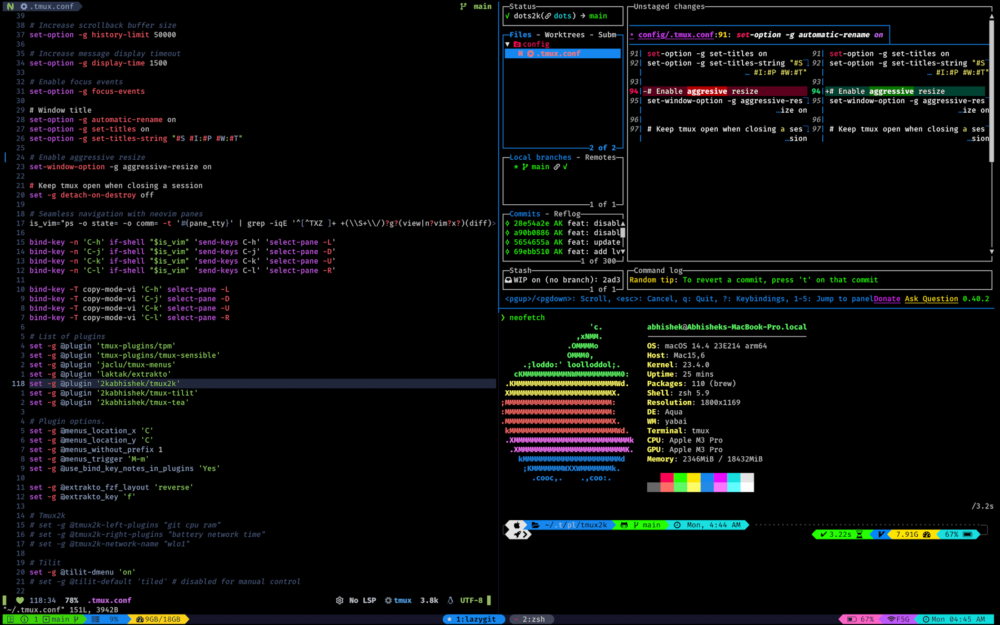

<div align = "center">

<h1><a href="https://2kabhishek.github.io/tmux2k">tmux2k</a></h1>

<a href="https://github.com/2KAbhishek/tmux2k/blob/main/LICENSE">
 </a>

<a href="https://github.com/2KAbhishek/tmux2k/graphs/contributors">
 </a>

<a href="https://github.com/2KAbhishek/tmux2k/stargazers">
</a>

<a href="https://github.com/2KAbhishek/tmux2k/network/members">
 </a>

<a href="https://github.com/2KAbhishek/tmux2k/watchers">
 </a>

<a href="https://github.com/2KAbhishek/tmux2k/pulse">
 </a>

<h3>Power & Pizzazz for tmux 🥊💅</h3>

<figure>
  
  <br/>
  <figcaption>tmux2k full screenshot</figcaption>
</figure>

<figure>
  
  <br/>
  <figcaption>tmux2k statusbar screenshot</figcaption>
</figure>

</div>

## What is this

tmux2k is a `tmux` plugin for that adds `powerline` support and pretty colors to your `tmux` status bar.

## Inspiration

tmux2k was inspired by [dracula/tmux](https://github.com/dracula/tmux).

## Prerequisites

Before you begin, ensure you have met the following requirements:

-   You have installed the latest version of `tmux`.
-   [tpm](https://github.com/tmux-plugins/tpm) for managing `tmux` plugins.
-   A [patched nerd font](https://www.nerdfonts.com/) for `powerline` and glyphs support.

## Installing tmux2k

Using `tpm`

If you are a `tpm` user, you can install the theme and keep up to date by adding the following to your `.tmux.conf` file:

```bash
set -g @plugin '2kabhishek/tmux2k'

```

Add any configuration options below this line in your tmux config.

### Activating tmux2k

-   Make sure run -b `~/.tmux/plugins/tpm/tpm` is at the bottom of your `.tmux.conf`
-   Run `tmux`
-   Use the `tpm` install command: prefix + I (default prefix is `ctrl+b`)

## Configuring tmux2k

```bash
# Tmux 2K default configs
# available plugins: battery, cpu-usage, git, gpu-usage, ram-usage, network, network-bandwidth, network-ping, weather, time
set -g @tmux2k-left-plugins "git cpu-usage ram-usage"
set -g @tmux2k-right-plugins "battery network time"
set -g @tmux2k-show-powerline true
set -g @tmux2k-show-fahrenheit false
set -g @tmux2k-military-time true
set -g @tmux2k-border-contrast true

# available colors: white, gray, dark_gray, light_purple, dark_purple, cyan, green, orange, red, pink, yellow
set -g @tmux2k-[plugin-name]-colors "[background] [foreground]"
set -g @tmux2k-cpu-usage-colors "blue dark_gray"

# it can accept `session`, `rocket`, `window`, or any character.
set -g @tmux2k-show-left-icon ""

# network interface to monitor
set -g @tmux2k-network-name "en0"/"wlo1" (Mac/Linux)

# update powerline symbols
set -g @tmux2k-show-left-sep ""
set -g @tmux2k-show-right-sep ""

# change refresh rate
set -g @tmux2k-refresh-rate 5
```

## How it was built

tmux2k was built using `neovim`, `shellcheck`, `nerd-fonts`.

## What I learned

-   Learned a lot about the `tmux` and `tpm` ecosystem.
-   Did some fancy shell scripting.

## What's next

### To-Do

-   [ ] Fix left plugins color logic
-   [ ] Add more section scripts

### 🧰 Tooling

-   [dots2k](https://github.com/2kabhishek/dots2k) — Dev Environment
-   [nvim2k](https://github.com/2kabhishek/nvim2k) — Personalized Editor
-   [sway2k](https://github.com/2kabhishek/sway2k) — Desktop Environment
-   [qute2k](https://github.com/2kabhishek/qute2k) — Personalized Browser

### 🔍 More Info

-   [tmux-tea](https://github.com/2kabhishek/tmux-tea) — Simple and powerful tmux session manager
-   [tmux-tilit](https://github.com/2kabhishek/tmux-tilit) — Turns tmux into a terminal window manager

<div align="center">

<strong>⭐ hit the star button if you found this useful ⭐</strong><br>

<a href="https://github.com/2KAbhishek/tmux2k">Source</a>
| <a href="https://2kabhishek.github.io/blog" target="_blank">Blog </a>
| <a href="https://twitter.com/2kabhishek" target="_blank">Twitter </a>
| <a href="https://linkedin.com/in/2kabhishek" target="_blank">LinkedIn </a>
| <a href="https://2kabhishek.github.io/links" target="_blank">More Links </a>
| <a href="https://2kabhishek.github.io/projects" target="_blank">Other Projects </a>

</div>
