<div align = "center">

<h1><a href="https://2kabhishek.github.io/tmux2k">tmux2k</a></h1>

<a href="https://github.com/2KAbhishek/tmux2k/blob/main/LICENSE">
 </a>

<a href="https://github.com/2KAbhishek/tmux2k/graphs/contributors">
 </a>

<a href="https://github.com/2KAbhishek/tmux2k/stargazers">
</a>

<a href="https://github.com/2KAbhishek/tmux2k/network/members">
 </a>

<a href="https://github.com/2KAbhishek/tmux2k/watchers">
 </a>

<a href="https://github.com/2KAbhishek/tmux2k/pulse">
 </a>

<h3>Make tmux powerful and pretty 🥊💅</h3>

</div>

tmux2k is a highly customizable framework designed to enhance your tmux status bar, providing you with a sleek and informative interface for your terminal sessions.


## ✨ Features

- **Enhanced Aesthetics**: Prettify your tmux setup with a stylish and modern status bar.
- **Informative Display**: Gain access to all the essential information you need right on your status bar, including system stats, git branch, weather updates, and more.
- **Plugin Ecosystem**: Comes with a wide array of plugins to tailor your status bar to your specific needs, covering everything from system monitoring to version control integration.
- **Ease of Customization**: Customize and extend tmux2k effortlessly, thanks to its intuitive configuration options and flexible architecture.
- **Dynamic Updates**: Enjoy real-time updates and dynamic content rendering for a seamless and responsive user experience.

### 🎨 Available Themes:

- default 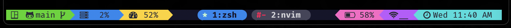
- default icons 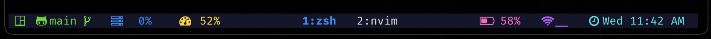
- catppuccin 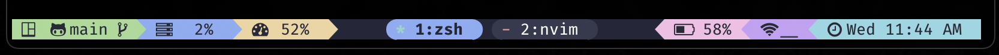
- catppuccin icons 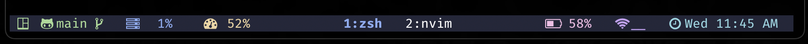
- gruvbox 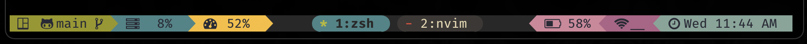
- gruvbox icons 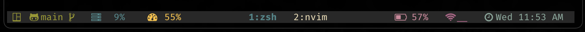
- monokai 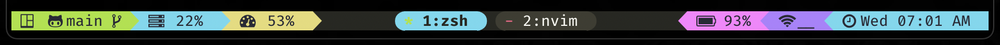
- monokai icons 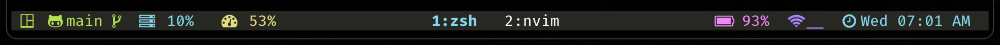
- onedark 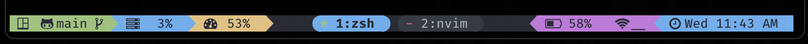
- onedark icons 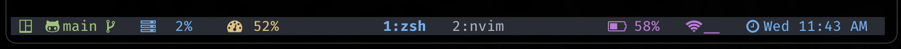
- duo 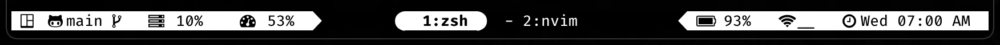
- duo icons 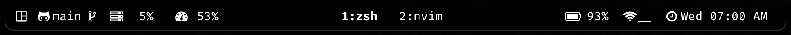
- duo blue 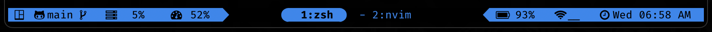
- default no powerline 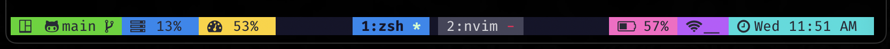

To use themes:

```bash
# use a theme
set -g @tmux2k-theme 'onedark'

# to show icons only
set -g @tmux2k-icons-only true

# to customize duo bg and fg
set -g @tmux2k-duo-fg "#1688f0" # this will get you duo blue shown above
set -g @tmux2k-duo-bg "#000000" # this will set the bg for duo theme

# to set powerline symbols
set -g @tmux2k-right-sep  # alternate right status bar sep
set -g @tmux2k-win-right-sep  # alternate window right sep

# to not show powerline
set -g @tmux2k-show-powerline false

# set start icon, accpets: `session`, 'window`, or any string
set -g @tmux2k-start-icon ""
```

#### 🖌️ Customize Theme Colors

##### Available Colors:

- `text`: Default text color. Default: `#282a36`
- `bg_main`: Background color for main sections. Default: `#15152a`
- `bg_alt`: Background color for alternate sections. Default: `#45455a`
- `black`: Black color. Default: `#0a0a0f`
- `white`: White color. Default: `#d5d5da`
- `red`: Red color. Default: `#ff001f`
- `light_red`: Light red color. Default: `#ff0055`
- `green`: Green color. Default: `#3dd50a`
- `light_green`: Light green color. Default: `#ccffcc`
- `blue`: Blue color. Default: `#1688f0`
- `light_blue`: Light blue color. Default: `#11dddd`
- `yellow`: Yellow color. Default: `#ffb86c`
- `light_yellow`: Light yellow color. Default: `#ffd21a`
- `purple`: Purple color. Default: `#bf58ff`
- `light_purple`: Light purple color. Default: `#ff65c6`

To customize theme colors:

```bash
set -g @tmux2k-text '#cdcdcd' # change text to white
set -g @tmux2k-bg-main '#ffffff' # change bg to white
set -g @tmux2k-yellow '#f8c800' # change yellow color
```

> You may have to restart `tmux` for some changes to reflect

### 🧩 Available Plugins

- `battery`: Show battery stats and percentage
- `git`: Show Git branch and status information
- `cpu`: Show CPU usage information
- `cwd`: Show current working directory
- `gpu`: Show GPU usage information
- `ram`: Show RAM usage information
- `network`: Show network status and statistics
- `bandwidth`: Show network bandwidth usage
- `ping`: Show network ping statistics
- `time`: Show current time and date
- `weather`: Show weather information
- `window`: tmux window list
- `pomodoro`: Shows pomodoro timer, needs [tmux-pomodoro-plus](https://github.com/olimorris/tmux-pomodoro-plus) (hit `prefix + p` to start)

To customize plugins, I'll highly recommend checking out their respective scripts in the [scripts](./scripts) folder.

Here's some example configurations:

```bash
# set the left and right plugin sections
set -g @tmux2k-left-plugins "git cpu ram"
set -g @tmux2k-right-plugins "battery network time"

# to set window list alignment (absolute-centre by default)
set -g @tmux2k-window-list-alignment 'left'

# to customize plugin colors
set -g @tmux2k-[plugin-name]-colors "[background] [foreground]"
set -g @tmux2k-cpu-colors "red black" # set cpu plugin bg to red, fg to black

# to enable compact window list size
set -g @tmux2k-compact-windows true

# change refresh rate
set -g @tmux2k-refresh-rate 5

# weather scale
set -g @tmux2k-show-fahrenheit false

# 24 hour time
set -g @tmux2k-military-time true

# Fully Custom Time format. Accepts any time format
# that can be passed to `date`.
set -g @tmux2k-time-format "%F %R"

# network interface to watch
set -g @tmux2k-network-name "wlo1"
```

#### 🪆 Add New Plugins

To add a new plugin, add a script to the [scripts](./scripts) folder that prints something to the console.

> The plugin name and script file name must match e.g: plugin named `foo` should have a file called `scripts/foo.sh`

## ⚡ Setup

### ⚙️ Requirements

Before you begin, ensure you have met the following requirements:

- You have installed the latest version of `tmux`.
- bash 5.2 or newer, mac users can install it using `brew install bash`
- [tpm](https://github.com/tmux-plugins/tpm) for managing `tmux` plugins.
- A [patched nerd font](https://www.nerdfonts.com/) for `powerline` and glyphs support.

### 💻 Installation

If you are a `tpm` user, you can install the theme and keep up to date by adding the following to your `.tmux.conf` file:

```bash
set -g @plugin '2kabhishek/tmux2k'

```

- Run `tmux`
- Use the `tpm` install command: prefix + I (default prefix is `ctrl+b`)

You can also directly clone the repo to your `~/.tmux/plugins/` folder.

## 🏗️ What's Next

- You tell me!

## 🧑‍💻 Behind The Code

### 🌈 Inspiration

I came across [dracula/tmux](https://github.com/dracula/tmux) sometime back and I wanted to create a more customizable and easy to expand solution.

### 💡 Challenges/Learnings

- Learned a lot about the `tmux` and `tpm` ecosystem.
- Did some fancy shell scripting.

## What's next

### To-Do

You tell me!

### 🧰 Tooling

- [dots2k](https://github.com/2kabhishek/dots2k) — Dev Environment
- [nvim2k](https://github.com/2kabhishek/nvim2k) — Personalized Editor
- [sway2k](https://github.com/2kabhishek/sway2k) — Desktop Environment
- [qute2k](https://github.com/2kabhishek/qute2k) — Personalized Browser

### 🔍 More Info

- [tmux-tea](https://github.com/2kabhishek/tmux-tea) — Simple and powerful tmux session manager
- [tmux-tilit](https://github.com/2kabhishek/tmux-tilit) — Turns tmux into a terminal window manager

<div align="center">

<strong>⭐ hit the star button if you found this useful ⭐</strong><br>

<a href="https://github.com/2KAbhishek/tmux2k">Source</a>
| <a href="https://2kabhishek.github.io/blog" target="_blank">Blog </a>
| <a href="https://twitter.com/2kabhishek" target="_blank">Twitter </a>
| <a href="https://linkedin.com/in/2kabhishek" target="_blank">LinkedIn </a>
| <a href="https://2kabhishek.github.io/links" target="_blank">More Links </a>
| <a href="https://2kabhishek.github.io/projects" target="_blank">Other Projects </a>

</div>
