<div align = "center">

<h1><a href="https://2kabhishek.github.io/tmux2k">tmux2k</a></h1>

<a href="https://github.com/2KAbhishek/tmux2k/blob/main/LICENSE">
 </a>

<a href="https://github.com/2KAbhishek/tmux2k/graphs/contributors">
 </a>

<a href="https://github.com/2KAbhishek/tmux2k/stargazers">
</a>

<a href="https://github.com/2KAbhishek/tmux2k/network/members">
 </a>

<a href="https://github.com/2KAbhishek/tmux2k/watchers">
 </a>

<a href="https://github.com/2KAbhishek/tmux2k/pulse">
 </a>

<h3>Make tmux powerful and pretty 🥊💅</h3>

</div>

tmux2k is a highly customizable framework designed to enhance your tmux status bar, providing you with a sleek and informative interface for your terminal sessions.


## ✨ Features

- **Informative Display**: Essential system stats, git info, weather, and more.
- **Plugin Ecosystem**: Extensive plugins for system monitoring and version control.
- **Easy Customization**: Intuitive configuration and flexible architecture.
- **Real-Time Updates**: Dynamic content rendering for a responsive experience.

## ⚡ Setup

### ⚙️ Requirements

> [!IMPORTANT]
> bash 5.2 or newer is required for colors to work correctly, macOS users can install it using `brew install bash`
> The default macOS terminal is not supported, I would recommend Kitty, Alacritty or another modern terminal emulator

- A [patched nerd font](https://www.nerdfonts.com/) for `powerline` and glyphs support.

### 💻 Installation

If you are a `tpm` user, you can install the theme and keep up to date by adding the following to your `.tmux.conf` file:

```bash
set -g @plugin '2kabhishek/tmux2k'
```

Run tmux and use the tpm install command: `prefix + I` (default prefix is `ctrl+b`)

You can also directly clone the repo to your `~/.tmux/plugins/` folder.

---

### 🎨 Available Themes:

- default 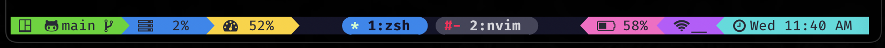
- default icons 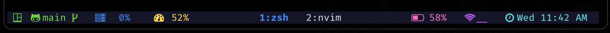
- catppuccin 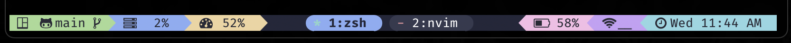
- catppuccin icons 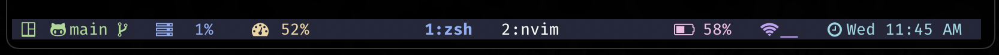
- gruvbox 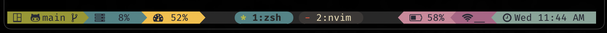
- gruvbox icons 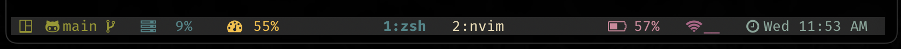
- monokai 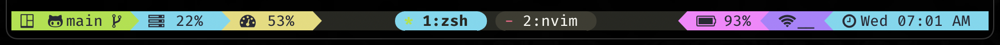
- monokai icons 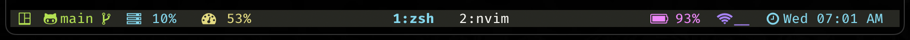
- onedark 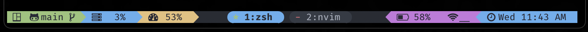
- onedark icons 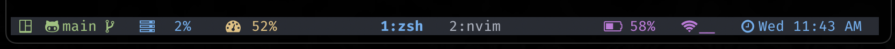
- duo 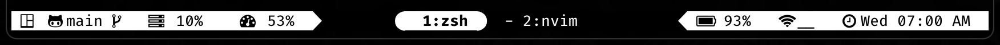
- duo icons 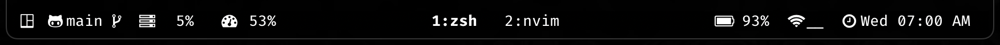
- duo blue 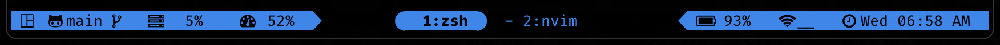
- default no powerline 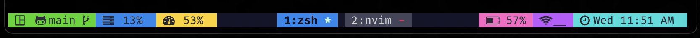

To use themes:

```bash
# use a theme
set -g @tmux2k-theme 'onedark'

# to show icons only
set -g @tmux2k-icons-only true

# to customize duo bg and fg
set -g @tmux2k-duo-fg "#1688f0" # this will get you duo blue shown above
set -g @tmux2k-duo-bg "#000000" # this will set the bg for duo theme

# to set powerline symbols
set -g @tmux2k-right-sep  # alternate right status bar sep
set -g @tmux2k-window-list-right-sep  # alternate window list right sep

# to not show powerline
set -g @tmux2k-show-powerline false

# set session icon, accepts: `session`, `window`, or any string
set -g @tmux2k-session-icon " #S" # `#W` for window name
```

#### 🖌️ Customize Theme Colors

##### Available Colors:

Base Colors

- `white`, `gray`, `black`
- `light_blue`, `blue`, `dark_blue`
- `light_green`, `green`, `dark_green`
- `light_orange`, `orange`, `dark_orange`
- `light_pink`, `pink`, `dark_pink`
- `light_purple`, `purple`, `dark_purple`
- `light_red`, `red`, `dark_red`
- `light_yellow`, `yellow`, `dark_yellow`

UI Colors

- `text`: Text color. Default: `black`
- `bg_main`: Background color. Default: `black`
- `bg_alt`: Alt Background color. Default: `gray`
- `message_bg`: Message background color. Default: `blue`
- `message_fg`: Message text color. Default: `black`
- `pane_active_border`: Active pane border color. Default: `blue`
- `pane_active_border_bg`: Active pane border color. Default: `black`
- `pane_border`: Inactive pane border color. Default: `gray`
- `pane_border_bg`: Inactive pane border color. Default: `black`
- `prefix_highlight`: Highlight color for active prefix. Default: `blue`

To customize theme colors:

```bash
set -g @tmux2k-light-yellow '#f8c800' # change light yellow base color
set -g @tmux2k-bg-main '#ffffff' # change bg to white
set -g @tmux2k-prefix-highlight '#f8c800' # change prefix color
```

> You may have to restart `tmux` for some changes to reflect

#### 🌈 Gradient Colors

Gradients dynamically color plugin output values based on their magnitude — lower values use colors from the start of the gradient, higher values from the end.

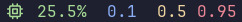

Each color represents a percentage range determined by the gradient's length. Given a 5-color gradient (5 ranges of 20%), a value of `25%` applies color **2** of **5**.

##### Named Gradients

> Gradient colors can be reversed by prepending a `!` to the gradient name, e.g.: `!gruvbox`

| Gradient                          | Colors                                                                             |
| --------------------------------- | ---------------------------------------------------------------------------------- |
| `catppuccin` \| `catppuccin-dark` |   |
| `gruvbox` \| `gruvbox-dark`       |         |
| `monokai` \| `monokai-dark`       |         |
| `onedark` \| `onedark-dark`       |         |
| `heat` \| `heat-dark`             |               |
| `cosmic` \| `cosmic-dark`         |           |

You can also define a custom gradient as a space-separated list of hex colors:

```bash
# 3-color gradient: R=0-32% G=33-65% B=66-100%
set -g @tmux2k-cpu-gradient '#ff0000 #00ff00 #0000ff'
```

##### Plugin Options

The following plugins support gradients and expose `@tmux2k-[plugin]-gradient` and `@tmux2k-[plugin]-icon-link-to` values :

| Plugin    | `icon-link-to` values |
| --------- | --------------------- |
| `cpu`     | `usage`, `1m,5m,15m`  |
| `ram`     | `usage`               |
| `gpu`     | `usage`               |
| `battery` | `usage`               |

```bash
set -g @tmux2k-[plugin]-gradient 'heat'
set -g @tmux2k-[plugin]-icon-link-to 'usage'
# example for cpu plugin:
set -g @tmux2k-cpu-gradient 'catppuccin'  # Use 'catppuccin' themed gradient
set -g @tmux2k-cpu-icon-link-to 'usage'   # Share usage value color with icon
```

---

### 🧩 Available Plugins

#### `bandwidth`

Show network bandwidth usage

- `tmux2k-bandwidth-network-name`: Network interface to track bandwidth of, default: `en0`
- `tmux2k-bandwidth-up-icon`: Icon for bandwidth upload usage, default: ``
- `tmux2k-bandwidth-down-icon`: Icon for bandwidth download usage, default: ``

#### `battery`

Show battery stats and percentage

- `tmux2k-battery-charging-icon`: Icon for charging status, default: ``
- `tmux2k-battery-missing-icon`: Icon for missing battery, default: `󱉝`
- `tmux2k-battery-percentage-0`: Icon for 0-25% battery, default: ``
- `tmux2k-battery-percentage-1`: Icon for 25-50% battery, default: ``
- `tmux2k-battery-percentage-2`: Icon for 50-75% battery, default: ``
- `tmux2k-battery-percentage-3`: Icon for 75-90% battery, default: ``
- `tmux2k-battery-percentage-4`: Icon for 90-100% battery, default: ``

#### `cpu`

Show CPU usage and load information

- `tmux2k-cpu-icon`: Icon for CPU usage, default: ``
- `tmux2k-cpu-display-usage`: Display CPU usage percentage, default: `true`
- <details><summary><code>tmux2k-cpu-usage-average</code>: Number of usage values to average, default: <code>0</code></summary><br>

  Display CPU usage as an average of _n_ values over _s_ seconds, where _n_ is the value given to this option and _s_ the value of `tmux2k-refresh-rate` multiplied by _n_.

  ##### Example

  ```bash
  # Display a 10s avg w/2s refresh rate
  set -g @tmux2k-refresh-rate 2
  set -g @tmux2k-cpu-usage-average 5

  # Display a 1m avg w/15s refresh rate
  set -g @tmux2k-refresh-rate 15
  set -g @tmux2k-cpu-usage-average 4
  ```

</details>

- `tmux2k-cpu-usage-decimal`: Display usage with decimal accuracy, default: `true`
- <details><summary><code>tmux2k-cpu-display-load</code>: Display CPU load averages, default: <code>false</code></summary><br>

  Displays CPU load averages given by `uptime`, each representing the average number of processes using or waiting to use CPU time over _1_, _5_ and _15_ minutes.

</details>

- `tmux2k-cpu-load-percent`: Display load averages as percentages, default: `true`
- <details><summary><code>tmux2k-cpu-load-normalize</code>: Normalize CPU load averages, default: <code>true</code></summary><br>

  When this option is `true`, each load average provided by `uptime` is divided by the number of logical cores on the system to give a more identifiable reading.

</details>

- <details><summary><code>tmux2k-cpu-load-averages</code>: CPU load averages to display, default: <code>1m 5m 15m</code></summary><br>

  The `uptime` command provides averages at _1_, _5_ and _15_ minute intervals. You can define which of the three intervals to display by passing them as a space-separated list.

  For example, passing `1m 15m` will display the _1_ and _15_ minute CPU load averages.

</details>

#### `cpu-temp`

Show CPU temperature

- `tmux2k-cpu-temp-icon`: Icon for CPU temperature, default: ``
- `tmux2k-cpu-temp-delimiter`: Decimal delimiter for CPU temperature, default: `.`
- `tmux2k-cpu-temp-round`: Round CPU temperature to the nearest integer, default: `false`

#### `cwd`

Show current working directory

- `tmux2k-cwd-icon`: Icon for directory, default: ``
- `tmux2k-cwd-length`: Maximum path length before truncation, default: `20`
- `tmux2k-cwd-min-depth`: Minimum directory depth before mid-truncation, default: `4`
- `tmux2k-cwd-prefix-chars`: Characters to keep from each directory name when truncating, default: `2`

#### `docker`

Show the number of running Docker containers, with support for filtering by grep term.

- `tmux2k-docker-icon`: Icon for docker, default: ``
- `tmux2k-docker-grep`: Grep term for filtering containers, default: ``

#### `git`

Show Git branch and status information

- `tmux2k-git-display-status`: Control git status display, default: `false`
- `tmux2k-git-added-icon`: Icon for added files, default: ``
- `tmux2k-git-modified-icon`: Icon for modified files, default: ``
- `tmux2k-git-updated-icon`: Icon for updated files, default: ``
- `tmux2k-git-deleted-icon`: Icon for deleted files, default: ``
- `tmux2k-git-repo-icon`: Icon for repository, default: ``
- `tmux2k-git-diff-icon`: Icon for differences, default: ``
- `tmux2k-git-no-repo-icon`: Icon for no repository, default: ``

#### `github`

Show the number of pending GitHub notifications using GitHub CLI (needs `gh` cli with auth logged in)

- `tmux2k-github-icon`: Icon for GitHub notifications, default: ``

#### `gpu`

Show GPU usage information

- `tmux2k-gpu-icon`: Icon for GPU usage, default: ``

#### `group`

Group output from several other plugins to present information in more compact manner.

```bash
# Define multiple groups
set -g @tmux2k-group1-plugins "cpu ram"
set -g @tmux2k-group1-delimiter " | "

set -g @tmux2k-group2-plugins "battery network"
set -g @tmux2k-group2-delimiter " • "

set -g @tmux2k-group3-plugins "time uptime"

# Use them in your status bar
set -g @tmux2k-left-plugins "session group1 git"
set -g @tmux2k-right-plugins "group2 group3"
```

By default, group plugins inherit colors from the plugin before them. To set custom colors:

```bash
# Set colors for specific groups
set -g @tmux2k-group1-colors "blue text"
set -g @tmux2k-group2-colors "purple text"
```

#### `mise`

Show active runtime versions managed by mise (dev tool version manager) with language icons

- `tmux2k-mise-max-tools`: Maximum number of tools to display, default: `3`
- `tmux2k-mise-exclude-tools`: Space-separated list of tools to exclude, default: `usage`

Supports language icons for popular languages out of the box, easy to add more.

#### `network`

Show network status and statistics

- `tmux2k-network-ethernet-icon`: Icon for Ethernet connection, default: `󰈀`
- `tmux2k-network-wifi-icon`: Icon for Wi-Fi connection, default: ``
- `tmux2k-network-offline-icon`: Icon for offline status, default: `󰌙`

#### `ping`

Show network ping statistics

- `tmux2k-ping-server`: Host/port to ping, default: `google.com`
- `tmux2k-ping-icon`: Icon for ping, default: `󱘖`

#### `pomodoro`

Shows pomodoro timer, needs [tmux-pomodoro-plus](https://github.com/olimorris/tmux-pomodoro-plus) (hit `prefix + p` to start)

#### `ram`

Show RAM usage information

- `tmux2k-ram-icon`: Icon for RAM usage, default: ``

#### `session`

Shows Current Session/Window with custom icon

- `tmux2k-session-format`: Format for Tmux session, default: `#S`
- `tmux2k-session-icon`: Icon for Tmux session, default: ``

#### `time`

Show current time and date

- `@tmux2k-time-format`: Sets the format for displaying the time. Default: `"%a %I:%M %p"`
- `@tmux2k-time-icon`: Sets the icon for the time display. Default: ``

#### `updates`

Show available system updates. The following package managers are supported:

- `pacman` [+ `yay`] (arch, manjaro, endeavourOS)
- `apt` (debian, ubuntu, popos, elementaryOS, mint, zorin)
- `brew` (macOS)

#### `weather`

Show weather information

- `@tmux2k-weather-scale`: Scale to use for temperature. Default: `c`, options: `[c, f, k]`
- `@tmux2k-weather-display-condition`: Whether to show weather condition name. Default: `true`
- `@tmux2k-weather-display-location`: Whether to show location name. Default: `false`
- `@tmux2k-weather-location`: Fixed location for weather. Default: `""`

#### `window-list`

tmux window list, this plugin is not supposed to be added to left / right plugin arrays, use the alignment option to position it.

- `@tmux2k-window-list-alignment`: Sets the alignment of the window list. Default: `'absolute-centre'`
  Available options: left | centre | right | absolute-centre
- `@tmux2k-window-list-left-sep`: Sets the left separator for the window list. Default: ``
- `@tmux2k-window-list-right-sep`: Sets the right separator for the window list. Default: ``
- `@tmux2k-window-list-format`: Sets the format for the window list. Default: `'#I:#W'`
- `@tmux2k-window-list-compact`: Enables or disables compact mode for the window list. Default: `false`

#### `uptime`

Show current system uptime

- `tmux2k-uptime-icon`: Icon for system uptime, default: `󱎫`

#### `tdo`

Show pending todo with [tdo](https://github.com/2kabhishek/tdo)

- `@tmux2k-tdo-icon`: Sets the icon for the todos display. Default: ``

#### 🪆 Add New Plugins

To add a new plugin:

- Copy `plugin/custom.sh` and rename it to match your plugin name.
- Update the new plugin script to `echo` the expected output.
- Add color declaration for your plugin name into the `plugin_colors` array in `main.sh`

> The plugin name and script file name must match e.g: plugin named `foo` should have a file called `scripts/foo.sh`

#### General Plugin Configs

```bash
# set the left and right plugin sections
set -g @tmux2k-left-plugins "session git cpu ram"
set -g @tmux2k-right-plugins "battery network time"

# control refresh rate of status bar plugins that display dynamic information
set -g @tmux2k-refresh-rate 5

# to customize plugin colors
set -g @tmux2k-[plugin-name]-colors "[background] [foreground]"
set -g @tmux2k-cpu-colors "red black" # set cpu plugin bg to red, fg to black
```

---

## 🏗️ What's Next

- You tell me!

## 🧑‍💻 Behind The Code

### 🌈 Inspiration

I came across [dracula/tmux](https://github.com/dracula/tmux) sometime back and I wanted to create a more customizable and easy to expand solution.

### 💡 Challenges/Learnings

- Learned a lot about the `tmux` and `tpm` ecosystem.
- Did some fancy shell scripting.

## What's next

### To-Do

You tell me!

### 🧰 Tooling

- [dots2k](https://github.com/2kabhishek/dots2k) — Dev Environment
- [nvim2k](https://github.com/2kabhishek/nvim2k) — Personalized Editor
- [sway2k](https://github.com/2kabhishek/sway2k) — Desktop Environment
- [qute2k](https://github.com/2kabhishek/qute2k) — Personalized Browser

### 🔍 More Info

- [tmux-tea](https://github.com/2kabhishek/tmux-tea) — Simple and powerful tmux session manager
- [tmux-tilit](https://github.com/2kabhishek/tmux-tilit) — Turns tmux into a terminal window manager

<div align="center">

<strong>⭐ hit the star button if you found this useful ⭐</strong><br>

<a href="https://github.com/2KAbhishek/tmux2k">Source</a>
| <a href="https://2kabhishek.github.io/blog" target="_blank">Blog </a>
| <a href="https://twitter.com/2kabhishek" target="_blank">Twitter </a>
| <a href="https://linkedin.com/in/2kabhishek" target="_blank">LinkedIn </a>
| <a href="https://2kabhishek.github.io/links" target="_blank">More Links </a>
| <a href="https://2kabhishek.github.io/projects" target="_blank">Other Projects </a>

</div>
