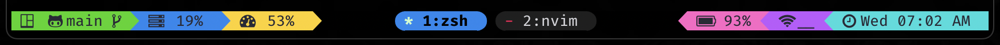
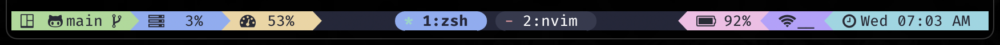
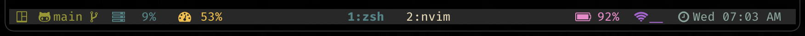
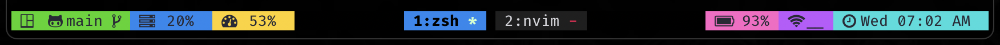

<div align = "center">

<h1><a href="https://2kabhishek.github.io/tmux2k">tmux2k</a></h1>

<a href="https://github.com/2KAbhishek/tmux2k/blob/main/LICENSE">
 </a>

<a href="https://github.com/2KAbhishek/tmux2k/graphs/contributors">
 </a>

<a href="https://github.com/2KAbhishek/tmux2k/stargazers">
</a>

<a href="https://github.com/2KAbhishek/tmux2k/network/members">
 </a>

<a href="https://github.com/2KAbhishek/tmux2k/watchers">
 </a>

<a href="https://github.com/2KAbhishek/tmux2k/pulse">
 </a>

<h3>Make tmux powerful and pretty 🥊💅</h3>

</div>

tmux2k is a highly customizable framework designed to enhance your tmux status bar, providing you with a sleek and informative interface for your terminal sessions.


## ✨ Features

- **Enhanced Aesthetics**: Prettify your tmux setup with a stylish and modern status bar.
- **Informative Display**: Gain access to all the essential information you need right on your status bar, including system stats, git branch, weather updates, and more.
- **Plugin Ecosystem**: Comes with a wide array of plugins to tailor your status bar to your specific needs, covering everything from system monitoring to version control integration.
- **Ease of Customization**: Customize and extend tmux2k effortlessly, thanks to its intuitive configuration options and flexible architecture.
- **Dynamic Updates**: Enjoy real-time updates and dynamic content rendering for a seamless and responsive user experience.

### 🎨 Available Themes:

- default 
- default icons 
- catppuccin 
- catppuccin icons 
- gruvbox 
- gruvbox icons 
- monokai 
- monokai icons 
- onedark 
- onedark icons 
- duo 
- duo icons 
- duo blue 
- default no powerline 

To use themes:

```bash
# use a theme
set -g @tmux2k-theme 'onedark'

# to show icons only
set -g @tmux2k-icons-only true

# to customize duo bg and fg
set -g @tmux2k-duo-fg "#1688f0" # this will get you duo blue shown above
set -g @tmux2k-duo-bg "#000000" # this will set the bg for duo theme

# to set powerline symbols
set -g @tmux2k-right-sep  # alternate right status bar sep
set -g @tmux2k-window-list-right-sep  # alternate window list right sep

# to not show powerline
set -g @tmux2k-show-powerline false

# set session icon, accpets: `session`, 'window`, or any string
set -g @tmux2k-session-icon " #S" # `#W` for window name
```

#### 🖌️ Customize Theme Colors

##### Available Colors:

- `text`: Default text color. Default: `#282a36`
- `bg_main`: Background color for main sections. Default: `#15152a`
- `bg_alt`: Background color for alternate sections. Default: `#45455a`
- `black`: Black color. Default: `#0a0a0f`
- `white`: White color. Default: `#d5d5da`
- `red`: Red color. Default: `#ff001f`
- `light_red`: Light red color. Default: `#ff0055`
- `green`: Green color. Default: `#3dd50a`
- `light_green`: Light green color. Default: `#ccffcc`
- `blue`: Blue color. Default: `#1688f0`
- `light_blue`: Light blue color. Default: `#11dddd`
- `yellow`: Yellow color. Default: `#ffb86c`
- `light_yellow`: Light yellow color. Default: `#ffd21a`
- `purple`: Purple color. Default: `#bf58ff`
- `light_purple`: Light purple color. Default: `#ff65c6`

To customize theme colors:

```bash
set -g @tmux2k-text '#cdcdcd' # change text to white
set -g @tmux2k-bg-main '#ffffff' # change bg to white
set -g @tmux2k-yellow '#f8c800' # change yellow color
```

> You may have to restart `tmux` for some changes to reflect

### 🧩 Available Plugins

1. `bandwidth`: Show network bandwidth usage

   - `tmux2k-bandwidth-network-name`: Network interface to track bandwidth of, default: `en0`

2. `battery`: Show battery stats and percentage
3. `cpu`: Show CPU usage information

   - `tmux2k-cpu-icon`: Icon for CPU usage, default: ``
   - `tmux2k-cpu-display-load`: Control CPU load display, default: `false`

4. `cwd`: Show current working directory
5. `git`: Show Git branch and status information

   - `tmux2k-git-display-status`: Control git status display, default: `false`
   - `tmux2k-git-added-icon`: Icon for added files, default: ``
   - `tmux2k-git-modified-icon`: Icon for modified files, default: ``
   - `tmux2k-git-updated-icon`: Icon for updated files, default: ``
   - `tmux2k-git-deleted-icon`: Icon for deleted files, default: ``
   - `tmux2k-git-repo-icon`: Icon for repository, default: ``
   - `tmux2k-git-diff-icon`: Icon for differences, default: ``
   - `tmux2k-git-no-repo-icon`: Icon for no repository, default: ``

6. `gpu`: Show GPU usage information

   - `tmux2k-gpu-icon`: Icon for GPU usage, default: ```

7. `network`: Show network status and statistics
8. `ping`: Show network ping statistics
9. `pomodoro`: Shows pomodoro timer, needs [tmux-pomodoro-plus](https://github.com/olimorris/tmux-pomodoro-plus) (hit `prefix + p` to start)
10. `ram`: Show RAM usage information

    - `tmux2k-ram-icon`: Icon for RAM usage, default: ``

11. `session`: Shows Current Session/Window with custom icon

    - `tmux2k-session-format`: Format for Tmux session, default: `#S`
    - `tmux2k-session-icon`: Icon for Tmux session, default: ``

12. `time`: Show current time and date

    - `@tmux2k-time-format`: Sets the format for displaying the time. Default: `"%a %I:%M %p"`
    - `@tmux2k-time-icon`: Sets the icon for the time display. Default: ``

13. `weather`: Show weather information

    - `@tmux2k-weather-scale`: Scale to use for temperature. Default: `c`, options: `[c, f, k]`
    - `@tmux2k-weather-display-location`: Whether to show location name. Default: `true`
    - `@tmux2k-weather-location`: Fixed location for weather. Default: `""`

14. `window_list`: tmux window list

    - `@tmux2k-window-list-left-sep`: Sets the left separator for the window list. Default: ``
    - `@tmux2k-window-list-right-sep`: Sets the right separator for the window list. Default: ``
    - `@tmux2k-window-list-alignment`: Sets the alignment of the window list. Default: `'absolute-centre'`
    - `@tmux2k-window-list-format`: Sets the format for the window list. Default: `'#I:#W'`
    - `@tmux2k-window-list-flags`: Enables or disables window flags in the window list. Default: `true`
    - `@tmux2k-window-list-compact`: Enables or disables compact mode for the window list. Default: `false`

To customize plugins, I'll highly recommend checking out their respective scripts in the [scripts](./scripts) folder.

#### Gemeral Plugin Config

```bash
# set the left and right plugin sections
set -g @tmux2k-left-plugins "session git cpu ram"
set -g @tmux2k-right-plugins "battery network time"

# contorl refresh rate, also applies to bandwidth, cpu, gpu, ping, pomodoro, ram
set -g @tmux2k-refresh-rate 5

# to customize plugin colors
set -g @tmux2k-[plugin-name]-colors "[background] [foreground]"
set -g @tmux2k-cpu-colors "red black" # set cpu plugin bg to red, fg to black
```

#### 🪆 Add New Plugins

To add a new plugin, add a script to the [plugins](./plugins) folder, tmux2k will put the `echo/print` of the plugin to the your tmux status bar.

> The plugin name and script file name must match e.g: plugin named `foo` should have a file called `scripts/foo.sh`

## ⚡ Setup

### ⚙️ Requirements

Before you begin, ensure you have met the following requirements:

- You have installed the latest version of `tmux`.
- bash 5.2 or newer, mac users can install it using `brew install bash`
- [tpm](https://github.com/tmux-plugins/tpm) for managing `tmux` plugins.
- A [patched nerd font](https://www.nerdfonts.com/) for `powerline` and glyphs support.

### 💻 Installation

If you are a `tpm` user, you can install the theme and keep up to date by adding the following to your `.tmux.conf` file:

```bash
set -g @plugin '2kabhishek/tmux2k'

```

- Run `tmux`
- Use the `tpm` install command: prefix + I (default prefix is `ctrl+b`)

You can also directly clone the repo to your `~/.tmux/plugins/` folder.

## 🏗️ What's Next

- You tell me!

## 🧑‍💻 Behind The Code

### 🌈 Inspiration

I came across [dracula/tmux](https://github.com/dracula/tmux) sometime back and I wanted to create a more customizable and easy to expand solution.

### 💡 Challenges/Learnings

- Learned a lot about the `tmux` and `tpm` ecosystem.
- Did some fancy shell scripting.

## What's next

### To-Do

You tell me!

### 🧰 Tooling

- [dots2k](https://github.com/2kabhishek/dots2k) — Dev Environment
- [nvim2k](https://github.com/2kabhishek/nvim2k) — Personalized Editor
- [sway2k](https://github.com/2kabhishek/sway2k) — Desktop Environment
- [qute2k](https://github.com/2kabhishek/qute2k) — Personalized Browser

### 🔍 More Info

- [tmux-tea](https://github.com/2kabhishek/tmux-tea) — Simple and powerful tmux session manager
- [tmux-tilit](https://github.com/2kabhishek/tmux-tilit) — Turns tmux into a terminal window manager

<div align="center">

<strong>⭐ hit the star button if you found this useful ⭐</strong><br>

<a href="https://github.com/2KAbhishek/tmux2k">Source</a>
| <a href="https://2kabhishek.github.io/blog" target="_blank">Blog </a>
| <a href="https://twitter.com/2kabhishek" target="_blank">Twitter </a>
| <a href="https://linkedin.com/in/2kabhishek" target="_blank">LinkedIn </a>
| <a href="https://2kabhishek.github.io/links" target="_blank">More Links </a>
| <a href="https://2kabhishek.github.io/projects" target="_blank">Other Projects </a>

</div>
