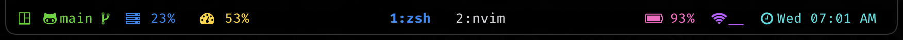
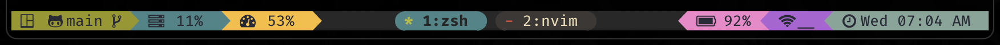
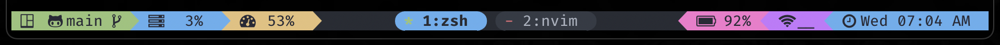
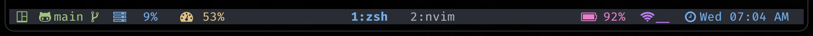

<div align = "center">

<h1><a href="https://2kabhishek.github.io/tmux2k">tmux2k</a></h1>

<a href="https://github.com/2KAbhishek/tmux2k/blob/main/LICENSE">
 </a>

<a href="https://github.com/2KAbhishek/tmux2k/graphs/contributors">
 </a>

<a href="https://github.com/2KAbhishek/tmux2k/stargazers">
</a>

<a href="https://github.com/2KAbhishek/tmux2k/network/members">
 </a>

<a href="https://github.com/2KAbhishek/tmux2k/watchers">
 </a>

<a href="https://github.com/2KAbhishek/tmux2k/pulse">
 </a>

<h3>Make tmux powerful and pretty 🥊💅</h3>

</div>

tmux2k is a highly customizable framework designed to enhance your tmux status bar, providing you with a sleek and informative interface for your terminal sessions.


## ✨ Features

- **Informative Display**: Essential system stats, git info, weather, and more.
- **Plugin Ecosystem**: Extensive plugins for system monitoring and version control.
- **Easy Customization**: Intuitive configuration and flexible architecture.
- **Real-Time Updates**: Dynamic content rendering for a responsive experience.

## ⚡ Setup

### ⚙️ Requirements

> [!IMPORTANT]
> bash 5.2 or newer, macOS users can install it using `brew install bash`

- A [patched nerd font](https://www.nerdfonts.com/) for `powerline` and glyphs support.

### 💻 Installation

If you are a `tpm` user, you can install the theme and keep up to date by adding the following to your `.tmux.conf` file:

```bash
set -g @plugin '2kabhishek/tmux2k'
```

Run tmux and use the tpm install command: `prefix + I` (default prefix is `ctrl+b`)

You can also directly clone the repo to your `~/.tmux/plugins/` folder.

### 🎨 Available Themes:

- default 
- default icons 
- catppuccin 
- catppuccin icons 
- gruvbox 
- gruvbox icons 
- monokai 
- monokai icons 
- onedark 
- onedark icons 
- duo 
- duo icons 
- duo blue 
- default no powerline 

To use themes:

```bash
# use a theme
set -g @tmux2k-theme 'onedark'

# to show icons only
set -g @tmux2k-icons-only true

# to customize duo bg and fg
set -g @tmux2k-duo-fg "#1688f0" # this will get you duo blue shown above
set -g @tmux2k-duo-bg "#000000" # this will set the bg for duo theme

# to set powerline symbols
set -g @tmux2k-right-sep  # alternate right status bar sep
set -g @tmux2k-window-list-right-sep  # alternate window list right sep

# to not show powerline
set -g @tmux2k-show-powerline false

# set session icon, accpets: `session`, 'window`, or any string
set -g @tmux2k-session-icon " #S" # `#W` for window name
```

#### 🖌️ Customize Theme Colors

##### Available Colors:

Base Colors

- `white`, `gray`, `black`
- `light_blue`, `blue`, `dark_blue`
- `light_green`, `green`, `dark_green`
- `light_orange`, `orange`, `dark_orange`
- `light_pink`, `pink`, `dark_pink`
- `light_purple`, `purple`, `dark_purple`
- `light_red`, `red`, `dark_red`
- `light_yellow`, `yellow`, `dark_yellow`

UI Colors

- `text`: Text color. Default: `black`
- `bg_main`: Background color. Default: `black`
- `bg_alt`: Alt Background color. Default: `gray`
- `message_bg`: Message background color. Default: `blue`
- `message_fg`: Message text color. Default: `black`
- `pane_active_border`: Active pane border color. Default: `blue`
- `pane_border`: Inactive pane border color. Default: `black`
- `prefix_highlight`: Highlight color for active prefix. Default: `blue`

To customize theme colors:

```bash
set -g @tmux2k-light-yellow '#f8c800' # change light yellow base color
set -g @tmux2k-bg-main '#ffffff' # change bg to white
set -g @tmux2k-prefix-highlight '#f8c800' # change prefix color
```

> You may have to restart `tmux` for some changes to reflect

### 🧩 Available Plugins

#### 1. `bandwidth`

Show network bandwidth usage

- `tmux2k-bandwidth-network-name`: Network interface to track bandwidth of, default: `en0`
- `tmux2k-bandwidth-up-icon`: Icon for bandwidth upload usage, default: ``
- `tmux2k-bandwidth-down-icon`: Icon for bandwidth download usage, default: ``

#### 2. `battery`

Show battery stats and percentage

- `tmux2k-battery-charging-icon`: Icon for charging status, default: ``
- `tmux2k-battery-missing-icon`: Icon for missing battery, default: `󱉝`
- `tmux2k-battery-percentage-0`: Icon for 0-25% battery, default: ``
- `tmux2k-battery-percentage-1`: Icon for 25-50% battery, default: ``
- `tmux2k-battery-percentage-2`: Icon for 50-75% battery, default: ``
- `tmux2k-battery-percentage-3`: Icon for 75-90% battery, default: ``
- `tmux2k-battery-percentage-4`: Icon for 90-100% battery, default: ``

#### 3. `cpu`

Show CPU usage information

- `tmux2k-cpu-icon`: Icon for CPU usage, default: ``
- `tmux2k-cpu-display-load`: Control CPU load display, default: `false`

#### 4. `cpu-temp`

Show CPU temperature

- `tmux2k-cpu-temp-icon`: Icon for CPU temperature, default: ``
- `tmux2k-cpu-temp-delimiter`: Decimal delimiter for CPU temperature, default: `.`
- `tmux2k-cpu-temp-round`: Round CPU temperature to the nearest integer, default: `false`


#### 5. `cwd`

Show current working directory

- `tmux2k-cwd-icon`: Icon for directory, default: ``

#### 6. `git`

Show Git branch and status information

- `tmux2k-git-display-status`: Control git status display, default: `false`
- `tmux2k-git-added-icon`: Icon for added files, default: ``
- `tmux2k-git-modified-icon`: Icon for modified files, default: ``
- `tmux2k-git-updated-icon`: Icon for updated files, default: ``
- `tmux2k-git-deleted-icon`: Icon for deleted files, default: ``
- `tmux2k-git-repo-icon`: Icon for repository, default: ``
- `tmux2k-git-diff-icon`: Icon for differences, default: ``
- `tmux2k-git-no-repo-icon`: Icon for no repository, default: ``

#### 7. `gpu`

Show GPU usage information

- `tmux2k-gpu-icon`: Icon for GPU usage, default: ```

#### 8. `group`

Group output from several other plugins to present information in more compact manner.

- `tmux2k-group-plugins`: Set plugins for combining their output, default: `cpu ram uptime`
- `tmux2k-group-delimiter`: Delimiter between plugin's output, default: ``

#### 9. `network`

Show network status and statistics

- `tmux2k-network-ethernet-icon`: Icon for Ethernet connection, default: `󰈀`
- `tmux2k-network-wifi-icon`: Icon for Wi-Fi connection, default: ``
- `tmux2k-network-offline-icon`: Icon for offline status, default: `󰌙`

#### 10. `ping`

Show network ping statistics

- `tmux2k-ping-server`: Host to ping, default: `google.com`

#### 11. `pomodoro`

Shows pomodoro timer, needs [tmux-pomodoro-plus](https://github.com/olimorris/tmux-pomodoro-plus) (hit `prefix + p` to start)

#### 12. `ram`

Show RAM usage information

- `tmux2k-ram-icon`: Icon for RAM usage, default: ``

#### 13. `session`

Shows Current Session/Window with custom icon

- `tmux2k-session-format`: Format for Tmux session, default: `#S`
- `tmux2k-session-icon`: Icon for Tmux session, default: ``

#### 14. `time`

Show current time and date

- `@tmux2k-time-format`: Sets the format for displaying the time. Default: `"%a %I:%M %p"`
- `@tmux2k-time-icon`: Sets the icon for the time display. Default: ``

#### 15. `weather`

Show weather information

- `@tmux2k-weather-scale`: Scale to use for temperature. Default: `c`, options: `[c, f, k]`
- `@tmux2k-weather-display-location`: Whether to show location name. Default: `true`
- `@tmux2k-weather-location`: Fixed location for weather. Default: `""`

#### 16. `window-list`

tmux window list, this plugin is not supposed to be added to left / right plugin arrays, use the alignment option to position it.

- `@tmux2k-window-list-alignment`: Sets the alignment of the window list. Default: `'absolute-centre'`
   Available options: left | centre | right | absolute-centre
- `@tmux2k-window-list-left-sep`: Sets the left separator for the window list. Default: ``
- `@tmux2k-window-list-right-sep`: Sets the right separator for the window list. Default: ``
- `@tmux2k-window-list-format`: Sets the format for the window list. Default: `'#I:#W'`
- `@tmux2k-window-list-compact`: Enables or disables compact mode for the window list. Default: `false`

#### 17. `uptime`

Show current system uptime

- `tmux2k-uptime-icon`: Icon for system uptime, default: `󰀠`

#### 🪆 Add New Plugins

To add a new plugin:

- Copy `plugin/custom.sh` and rename it to match your plugin name.
- Update the new plugin script to `echo` the expected output.
- Add color declaration for your plugin name into the `plugin_colors` array in `main.sh`

> The plugin name and script file name must match e.g: plugin named `foo` should have a file called `scripts/foo.sh`

#### Gemeral Plugin Configs

```bash
# set the left and right plugin sections
set -g @tmux2k-left-plugins "session git cpu ram"
set -g @tmux2k-right-plugins "battery network time"

# contorl refresh rate, applies to bandwidth, ping
set -g @tmux2k-refresh-rate 1

# to customize plugin colors
set -g @tmux2k-[plugin-name]-colors "[background] [foreground]"
set -g @tmux2k-cpu-colors "red black" # set cpu plugin bg to red, fg to black
```

## 🏗️ What's Next

- You tell me!

## 🧑‍💻 Behind The Code

### 🌈 Inspiration

I came across [dracula/tmux](https://github.com/dracula/tmux) sometime back and I wanted to create a more customizable and easy to expand solution.

### 💡 Challenges/Learnings

- Learned a lot about the `tmux` and `tpm` ecosystem.
- Did some fancy shell scripting.

## What's next

### To-Do

You tell me!

### 🧰 Tooling

- [dots2k](https://github.com/2kabhishek/dots2k) — Dev Environment
- [nvim2k](https://github.com/2kabhishek/nvim2k) — Personalized Editor
- [sway2k](https://github.com/2kabhishek/sway2k) — Desktop Environment
- [qute2k](https://github.com/2kabhishek/qute2k) — Personalized Browser

### 🔍 More Info

- [tmux-tea](https://github.com/2kabhishek/tmux-tea) — Simple and powerful tmux session manager
- [tmux-tilit](https://github.com/2kabhishek/tmux-tilit) — Turns tmux into a terminal window manager

<div align="center">

<strong>⭐ hit the star button if you found this useful ⭐</strong><br>

<a href="https://github.com/2KAbhishek/tmux2k">Source</a>
| <a href="https://2kabhishek.github.io/blog" target="_blank">Blog </a>
| <a href="https://twitter.com/2kabhishek" target="_blank">Twitter </a>
| <a href="https://linkedin.com/in/2kabhishek" target="_blank">LinkedIn </a>
| <a href="https://2kabhishek.github.io/links" target="_blank">More Links </a>
| <a href="https://2kabhishek.github.io/projects" target="_blank">Other Projects </a>

</div>
